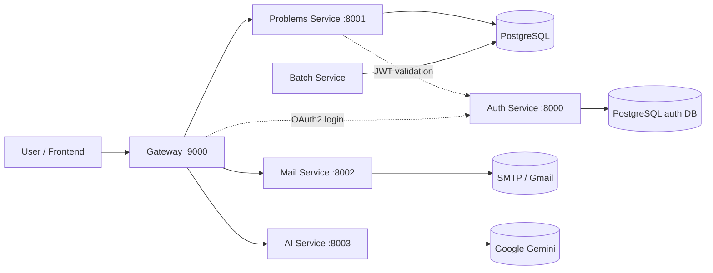

# Leet Journal
# GSSOC'26 contributors [read this first](https://github.com/hardikxk/leet-journal/discussions/30#discussion-10072805)


Leet Journal is a Spring Boot microservices project for tracking LeetCode progress, managing problem metadata, authenticating users, sending mail, and experimenting with AI-assisted problem solving.

## Overview

The repository is organized as a set of independently runnable services:

- `auth` handles authentication and authorization server concerns.
- `gateway` is the public entry point and forwards requests to backend services.
- `problems-service` serves problem data and execution endpoints.
- `batch-service` is responsible for batch ingestion and scheduled-style processing.
- `mail-service` sends MIME email notifications.
- `ai-service` streams AI responses for DSA help.

## Architecture

The system follows a gateway-first microservice layout.



### Request flow

- The client talks to `gateway` on port `9000`.
- `gateway` relays authenticated requests to the downstream services.
- `/problems/**` and `/code/**` are forwarded to `problems-service` on port `8001`.
- `/mail/**` is forwarded to `mail-service` on port `8002`.
- `/ai/**` is forwarded to `ai-service` on port `8003`.
- `auth` runs on port `8000` and issues tokens consumed by the other services.

### Service responsibilities

- `auth` provides the OAuth2 authorization server and persists identity data in PostgreSQL.
- `problems-service` exposes endpoints for listing problems, fetching a problem by id, checking the current authenticated user, and running code locally.
- `batch-service` loads problem data from CSV and stores it in the database.
- `mail-service` sends email notifications using SMTP.
- `ai-service` wraps the Google GenAI client and streams chat-style responses.

## Repository Layout

Each service is a standalone Maven project:

- `auth/`
- `gateway/`
- `problems-service/`
- `batch-service/`
- `mail-service/`
- `ai-service/`

The services are intentionally separate so they can be developed, tested, and deployed independently.

## Prerequisites

- Java 25
- Maven Wrapper or Maven
- PostgreSQL
- SMTP credentials for mail delivery
- Google GenAI API key for the AI service

## Project Version

The current repository version is tracked in the root `VERSION` file.

## Configuration

Common local defaults are defined in each service’s `application.yml` or `application.yaml` file.

Environment variables used by the project include:

- `GMAIL_MAIL_USERNAME`
- `GMAIL_MAIL_PASSWORD`
- `GOOGLE_GENAI_API_KEY`
- `AUTH_SERVER_URI` for overriding the auth server location used by the gateway

PostgreSQL connection defaults used by the services point to `jdbc:postgresql://localhost:5432/db` with the username `user` and password `pass`.

## Running Locally
You will need a PostgreSQL database running for the application. Best way to do this is to run a container using Docker / Podman and configuring your environment variables. By default the application expects the container on port 5432 with the following config:
Database name -> db
Username -> user
Password -> pass


Start the services in this order (to prevent unnecessary errors):

1. PostgreSQL Database (container or locally)
2. `auth`
3. `problems-service`
4. `mail-service`
5. `ai-service`
6. `gateway`
7. `batch-service` - only if you want to import data or run batch jobs

Use the Maven Wrapper from each service directory, for example:

```bash
cd auth
./mvnw spring-boot:run
```

Repeat the same pattern for the other services.

## Useful Endpoints

- `GET http://localhost:9000/problems/all`
- `GET http://localhost:9000/problems/find/{id}`
- `GET http://localhost:9000/code/run`
- `GET http://localhost:9000/mail/mime?to=...&subject=...&text=...`
- `GET http://localhost:9000/ai/chat?prompt=...`

## Developer Documentation

- [Contributing Guide](CONTRIBUTING.md)
- [Project Setup Guide](SETUP.md)

## Project Status
This project is under active development and is intended to grow as an open source learning platform for LeetCode practice and DSA tooling.
Contributions are welcome. If you are planning a larger change, open an issue first so the approach can be aligned before implementation.

### How to contribute

1. Fork the repository.
2. Create a feature branch from `master`.
3. Make the smallest focused change that solves the problem.
4. Run the relevant service tests before opening a pull request.
5. Open a pull request with a clear description of the change and any setup or verification steps.

### What I look for

- Small, reviewable pull requests.
- Clear commit messages and PR descriptions.
- Tests for new behavior when practical.
- Documentation (future implementation) updates when behavior or setup changes.

### Resources that can help you
- The Spring Documentation.
	- [Spring Authorization Server](https://docs.spring.io/spring-authorization-server/reference/index.html)
    - [Spring Cloud Gateway WebMVC](https://docs.spring.io/spring-cloud-gateway/reference/spring-cloud-gateway-server-webmvc.html)
    - [Spring AI](https://docs.spring.io/spring-ai/reference/)
- [Dan Vega's](https://www.youtube.com/@DanVega) youtube tutorials.

### Coding conventions

- Follow the existing Spring Boot structure in each service.
- Keep controllers thin and push business logic into services.
- Prefer explicit configuration in the service `application.yml` files.
- Avoid introducing unnecessary dependencies unless they materially improve the codebase.

## Project Status

This project is under active development and is intended to grow as an open source learning platform for LeetCode practice and DSA tooling.
